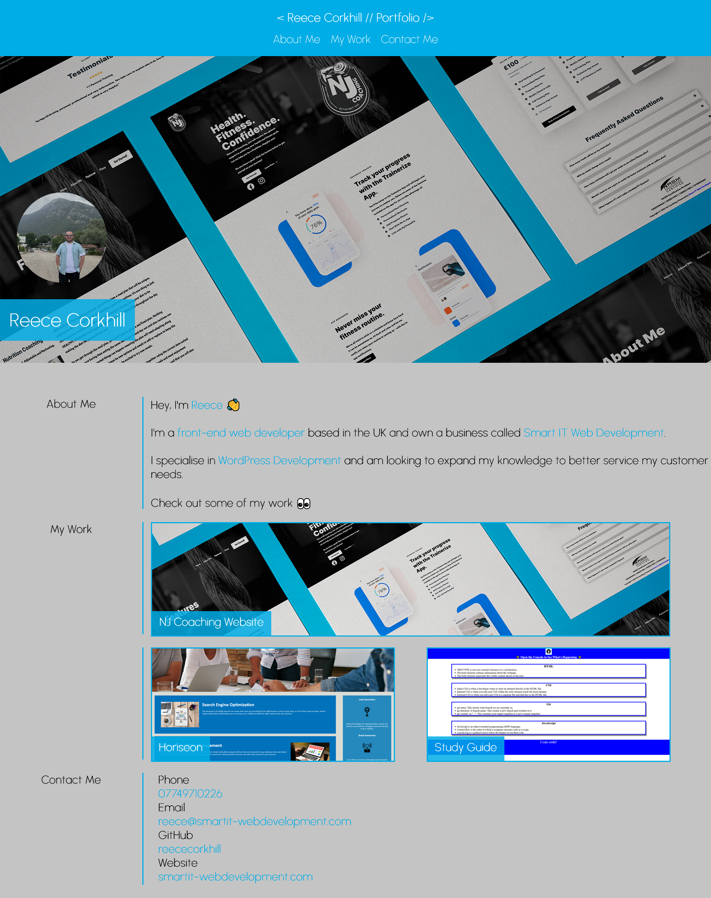

# Reece Corkhill's Portfolio

This is my official portfolio repository.

## Description

All web developers must be able to showcase their skills, right? Well, here’s my official portfolio repository.

The aim of this project was to create a functioning portfolio website using HTML and CSS, and include flex and grid. The motivation for doing so is that I wanted to be able to keep track of what I’m learning by showcasing it on a deployed application that can be updated with new technologies, as I learn them.

The problem was, I didn’t have a place to store my portfolio and make it accessible to potential clients or job providers. This problem has finally been solved by creating a structure which allows me to showcase information about me and my projects and also including contact information.

## Table of Contents

- [Description](#description)
- [Installation](#installation)
- [Credits](#credits)
- [License](#license)

## Installation

N/A

## Usage

My official portfolio website can be viewed <a href="https://reececorkhill.github.io/Portfolio/"> here</a>.

## Credits

Portfolio project was developed by <a href="https://github.com/reececorkhill">reececorkhill</a>.

## License

MIT License

Copyright (c) 2023 reececorkhill

Permission is hereby granted, free of charge, to any person obtaining a copy
of this software and associated documentation files (the "Software"), to deal
in the Software without restriction, including without limitation the rights
to use, copy, modify, merge, publish, distribute, sublicense, and/or sell
copies of the Software, and to permit persons to whom the Software is
furnished to do so, subject to the following conditions:

The above copyright notice and this permission notice shall be included in all
copies or substantial portions of the Software.

THE SOFTWARE IS PROVIDED "AS IS", WITHOUT WARRANTY OF ANY KIND, EXPRESS OR
IMPLIED, INCLUDING BUT NOT LIMITED TO THE WARRANTIES OF MERCHANTABILITY,
FITNESS FOR A PARTICULAR PURPOSE AND NONINFRINGEMENT. IN NO EVENT SHALL THE
AUTHORS OR COPYRIGHT HOLDERS BE LIABLE FOR ANY CLAIM, DAMAGES OR OTHER
LIABILITY, WHETHER IN AN ACTION OF CONTRACT, TORT OR OTHERWISE, ARISING FROM,
OUT OF OR IN CONNECTION WITH THE SOFTWARE OR THE USE OR OTHER DEALINGS IN THE
SOFTWARE.

